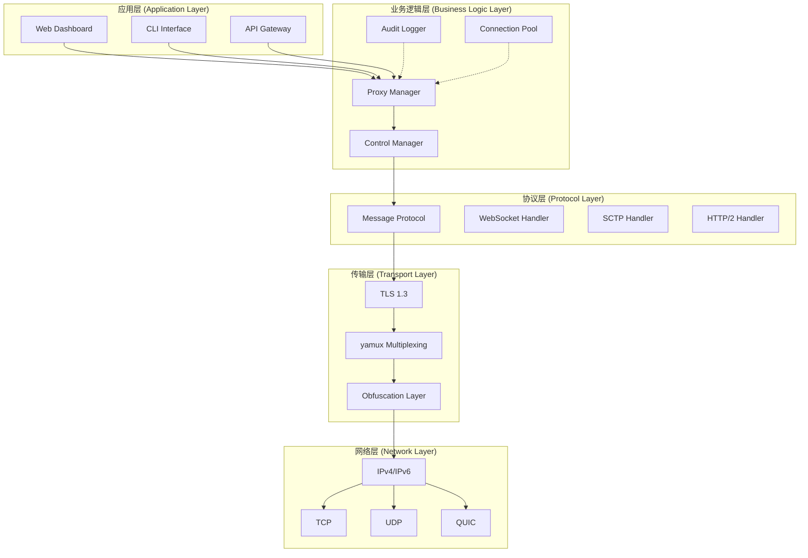
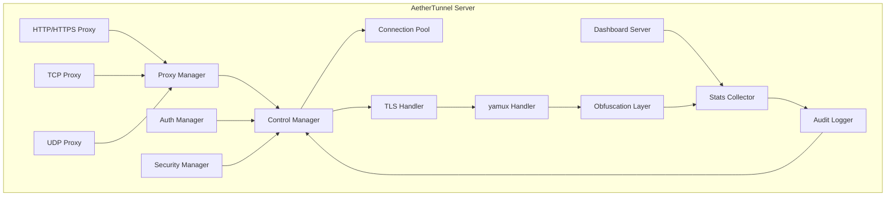
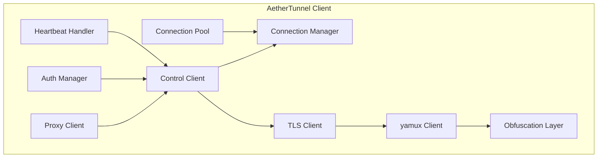

# AetherTunnel 架构设计文档

## 目录

1. [概述](#概述)
2. [架构原则](#架构原则)
3. [系统架构](#系统架构)
4. [核心组件](#核心组件)
5. [模块划分](#模块划分)
6. [接口定义](#接口定义)
7. [通信流程](#通信流程)
8. [数据流](#数据流)
9. [扩展机制](#扩展机制)
10. [技术栈](#技术栈)
11. [性能优化](#性能优化)
12. [安全设计](#安全设计)
13. [部署架构](#部署架构)

---

## 概述

AetherTunnel 是一个基于 Go 1.22.2 实现的高性能、安全增强型内网穿透工具。它采用了模块化的设计理念，将各个功能组件解耦，提供了良好的可扩展性和可维护性。

### 设计目标

- **安全性优先**：多层认证和加密机制
- **高性能**：连接复用和智能连接池
- **可扩展性**：插件系统和模块化设计
- **跨平台**：支持主流操作系统和CPU架构
- **易用性**：简洁的配置和清晰的使用文档

### 核心特性

1. **多层安全防护**
   - TLS 1.3 双向认证
   - ChaCha20-Poly1305 数据加密
   - Ed25519 签名验证
   - IP 白名单和连接限制

2. **高性能架构**
   - yamux 多路复用
   - 连接池管理
   - 零拷贝数据转发
   - 异步并发处理

3. **丰富的协议支持**
   - WebSocket 实时通信
   - SCTP 高可靠性传输
   - HTTP/2 高效传输
   - 自适应协议选择

4. **创新功能**
   - 流量伪装（TLS/HTTP/HTTP2）
   - 智能路由（6种策略）
   - 实时可视化（Web仪表板）
   - IPv6 原生支持

---

## 架构原则

### 1. 分层架构

```
┌─────────────────────────────────────────┐
│         Application Layer              │  ← 应用层（代理、监控）
├─────────────────────────────────────────┤
│         Service Layer                  │  ← 服务层（控制、连接管理）
├─────────────────────────────────────────┤
│         Protocol Layer                 │  ← 协议层（消息编解码）
├─────────────────────────────────────────┤
│         Transport Layer                │  ← 传输层（TLS、多路复用）
├─────────────────────────────────────────┤
│         Network Layer                  │  ← 网络层（TCP、UDP）
└─────────────────────────────────────────┘
```

### 2. 关注点分离

- **控制面**：管理连接、认证、配置
- **数据面**：处理实际的数据转发
- **管理面**：监控、日志、API

### 3. 零信任原则

每个连接、每条消息都需要验证，不信任默认网络环境。

### 4. 接口驱动

- 使用接口定义模块契约
- 便于单元测试
- 支持插件扩展

### 5. 可观测性

- 完整的审计日志
- 实时指标收集
- 健康检查机制

---

## 系统架构

### 整体架构图



**详细架构图**: 参见 [`architecture_diagram.md`](./architecture_diagram.md)

### 服务端架构



### 客户端架构



---

## 核心组件

### 服务端组件

#### 1. Server (server/main.go)

主服务器，负责：
- 启动和管理所有子组件
- 处理信号和优雅关闭
- 管理TLS配置和监听器
- 启动HTTP仪表板

#### 2. ControlManager (server/control.go)

控制连接管理器，负责：
- 管理所有客户端控制连接
- 处理客户端登录和认证
- 维护会话状态
- 心跳检测和超时处理

#### 3. ProxyManager (server/proxy_manager.go)

代理管理器，负责：
- 创建和销毁代理实例
- 管理监听端口
- 分发工作连接
- 收集代理状态

#### 4. Auth & Security (pkg/util/auth.go)

认证和安全模块，提供：
- Token 认证
- Ed25519 签名验证
- 连接限制
- IP 封禁
- 审计日志

### 客户端组件

#### 1. Client (client/main.go)

主客户端，负责：
- 建立与服务器的连接
- 管理密钥对
- 注册代理
- 维护控制连接

#### 2. Control (client/main.go)

控制连接，负责：
- 与服务器保持连接
- 发送心跳
- 处理服务器指令
- 接收工作连接请求

### 公共组件

#### 1. Protocol (pkg/protocol/)

消息协议定义：
- Login/LoginResp：登录认证
- NewProxy/NewProxyResp：代理注册
- StartWorkConn：工作连接建立
- Ping/Pong：心跳保活
- 数据结构定义和序列化

#### 2. Crypto (pkg/crypto/)

加密模块：
- **AEAD (encryption.go)**：ChaCha20-Poly1305 加密
- **Signature**: Ed25519 签名和 HMAC
- 密钥派生和管理

#### 3. Network (pkg/net/)

网络工具：
- **Mux (mux.go)**：yamux 多路复用封装
- TLS 配置和连接
- Context 连接封装
- 连接和数据转发

#### 4. Config (pkg/config/)

配置管理：
- TOML 配置解析
- 配置验证
- 默认值设置

---

## 模块划分

### 核心模块

#### 1. protocol 模块 (`pkg/protocol/`)

**职责**: 协议定义和消息处理

**主要文件**:
- `message.go`: 消息协议定义
- `websocket.go`: WebSocket 处理
- `http.go`: HTTP/2 处理
- `sctp.go`: SCTP 处理

**核心接口**:
```go
type MessageHandler interface {
    HandleAuth(conn net.Conn, payload []byte) error
    HandleHeartbeat(conn net.Conn) error
    HandleProxyRequest(conn net.Conn, payload []byte) error
}
```

#### 2. crypto 模块 (`pkg/crypto/`)

**职责**: 加密和签名

**主要文件**:
- `encryption.go`: ChaCha20-Poly1305 加密
- `signature.go`: Ed25519 签名

**核心接口**:
```go
type Cipher interface {
    Encrypt(plaintext []byte) ([]byte, error)
    Decrypt(ciphertext []byte) ([]byte, error)
}

type Signer interface {
    Sign(data []byte) ([]byte, error)
    Verify(data, signature []byte) bool
}
```

#### 3. net 模块 (`pkg/net/`)

**职责**: 网络传输和多路复用

**主要文件**:
- `mux.go`: yamux 多路复用
- `tls.go`: TLS 配置
- `connection.go`: 连接封装

**核心接口**:
```go
type Transport interface {
    Dial(network, address string) (net.Conn, error)
    Listen(network, address string) (net.Listener, error)
}

type Multiplexer interface {
    OpenChannel(id string) (Channel, error)
    CloseChannel(id string) error
}
```

#### 4. server 模块 (`pkg/server/`)

**职责**: 服务端业务逻辑

**主要文件**:
- `main.go`: 服务端入口
- `control.go`: 控制连接管理
- `proxy_manager.go`: 代理管理
- `dashboard.go`: 仪表板

**核心接口**:
```go
type ControlManager interface {
    HandleConnection(conn net.Conn) error
    Authenticate(conn net.Conn, token string) (bool, error)
    Heartbeat(conn net.Conn) error
}

type ProxyManager interface {
    CreateProxy(proxy *ProxyConfig) (Proxy, error)
    HandleConnection(conn net.Conn) error
}
```

#### 5. client 模块 (`client/`)

**职责**: 客户端业务逻辑

**主要文件**:
- `main.go`: 客户端入口
- `control.go`: 控制连接
- `proxy.go`: 代理客户端

#### 6. config 模块 (`pkg/config/`)

**职责**: 配置管理

**主要文件**:
- `config.go`: 配置解析和验证

**配置结构**:
```go
type Config struct {
    Server   ServerConfig
    Client   ClientConfig
    TLS      TLSConfig
    Security SecurityConfig
    Logging  LoggingConfig
}
```

### 创新功能模块

#### 7. obfuscation 模块 (`pkg/obfuscation/`)

**职责**: 流量伪装

**主要功能**:
- TLS 流量伪装
- HTTP 流量伪装
- XOR 混淆

**核心接口**:
```go
type Obfuscator interface {
    Obfuscate(data []byte) ([]byte, error)
    Deobfuscate(data []byte) ([]byte, error)
    Layer() string
}
```

#### 8. adaptive 模块 (`pkg/adaptive/`)

**职责**: 协议自适应

**主要功能**:
- 网络质量监控
- 协议自动切换
- 智能降级

#### 9. routing 模块 (`pkg/routing/`)

**职责**: 智能路由

**主要功能**:
- 路由规则引擎
- 健康检查
- 负载均衡

#### 10. visualization 模块 (`pkg/visualization/`)

**职责**: 实时可视化

**主要功能**:
- 指标收集
- Web 仪表板
- 数据分析

#### 11. vpn 模块 (`pkg/vpn/`)

**职责**: VPN 支持

**主要功能**:
- TUN 设备管理
- 路由配置
- 客户端管理

#### 12. ipv6 模块 (`pkg/ipv6/`)

**职责**: IPv6 支持

**主要功能**:
- IPv6 地址管理
- NAT 穿透
- STUN 支持

---

## 接口定义

完整的接口定义请参考 [`pkg/interfaces/README.md`](../pkg/interfaces/README.md)

### 核心接口概览

1. **Proxy 接口**: 代理基本行为
2. **ConnectionManager 接口**: 连接管理
3. **MessageHandler 接口**: 消息处理
4. **Cipher 接口**: 加密
5. **Signer 接口**: 签名
6. **Transport 接口**: 传输层
7. **Multiplexer 接口**: 多路复用
8. **ControlManager 接口**: 控制管理
9. **ProxyManager 接口**: 代理管理
10. **AuditLogger 接口**: 审计日志
11. **HealthChecker 接口**: 健康检查
12. **MetricsCollector 接口**: 指标收集
13. **Plugin 接口**: 插件系统
14. **Middleware 接口**: 中间件

---

## 通信流程

### 1. 客户端登录流程

```
Client                          Server
  │                               │
  │  1. TCP/TLS Connect          │
  ├─────────────────────────────▶ │
  │                               │
  │  2. Login (Token + Signature) │
  ├─────────────────────────────▶ │
  │                               │  ┌─────────────┐
  │                               │  │ Verify Token│
  │                               │  └─────────────┘
  │                               │
  │  3. LoginResp (runID + Nonce) │
  │ ◀─────────────────────────────┤
  │                               │
  │  4. Register Proxies          │
  ├─────────────────────────────▶ │
  │                               │
  │  5. Proxy Responses           │
  │ ◀─────────────────────────────┤
  │                               │
  │  6. Start Heartbeat           │
  │ ◀─────────── Ping ───────────▶ │
  │ ◀─── Pong ───────────────────▶ │
  │                               │
```

### 2. 数据转发流程

```
External User              Server                Client                Local Service
     │                        │                     │                        │
     │  1. Connect             │                     │                        │
     ├──────────────────────▶│                     │                        │
     │                        │  2. Get Work Conn   │                        │
     │                        ├────────────────────▶│                        │
     │                        │                     │                        │
     │                        │  3. StartWorkConn  │                        │
     │                        │◀────────────────────┤                        │
     │                        │                     │  4. Connect Local     │
     │                        │                     ├───────────────────────▶│
     │                        │                     │                        │
     │  5. Data Forward       │                     │                        │
     │ ◀─────────────────────▶│                     │                        │
     │                        │  6. Data Forward    │                        │
     │                        ├────────────────────▶│                        │
     │                        │                     │  7. Data Forward      │
     │                        │                     ├───────────────────────▶│
     │                        │                     │                        │
     │                        │                     │  8. Response Data     │
     │                        │◀────────────────────┤◀──────────────────────┤
     │  9. Response Data       │                     │                        │
     │ ◀─────────────────────▶│                     │                        │
```

### 3. 心跳保活流程

```
Client                          Server
  │                               │
  │  1. Ping (with timestamp)     │
  ├─────────────────────────────▶ │
  │                               │
  │  2. Verify timestamp          │
  │  3. Send Pong                  │
  │ ◀─────────────────────────────┤
  │                               │
  │  4. Verify Pong timestamp     │
  │                               │
  │  5. Ping (next cycle)         │
  ├─────────────────────────────▶ │
  │  ...                          │
```

---

## 数据流

### 1. 控制通道数据流

```
┌──────────┐    Message    ┌──────────┐    Message    ┌──────────┐
│  Client  │ ────────────▶ │  Server  │ ◀──────────── │  Client  │
└──────────┘               └──────────┘               └──────────┘
   Login                         NewProxyResp
   NewProxy                       Ping
   Ping                           StartWorkConn
   CloseProxy
```

### 2. 数据通道数据流

```
┌───────────┐    User Data    ┌───────────┐    Work Data   ┌───────────┐
│  External │ ──────────────▶ │  Server   │ ────────────▶ │  Client   │
│   User    │                │           │               │           │
└───────────┘                └───────────┘               └───────────┘
                                                                 │
                                                                ▼
                                                         ┌───────────┐
                                                         │   Local   │
                                                         │  Service  │
                                                         └───────────┘
```

---

## 扩展机制

### 1. 代理类型扩展

通过实现 `Proxy` 接口可以添加新的代理类型：

```go
type Proxy interface {
    Run() error
    HandleWorkConn(conn net.Conn, msg *protocol.StartWorkConn)
    Close()
}
```

### 2. 认证方式扩展

通过实现 `AuthVerifier` 接口可以添加新的认证方式：

```go
type AuthVerifier interface {
    VerifyLogin(login *Login) error
    VerifyWorkConn(msg *NewWorkConn) error
}
```

### 3. 加密方式扩展

通过实现 `Cipher` 接口可以添加新的加密算法：

```go
type Cipher interface {
    Encrypt(plaintext []byte) ([]byte, error)
    Decrypt(ciphertext []byte) ([]byte, error)
}
```

### 4. 插件系统（计划中）

未来将支持插件系统，允许：
- 自定义消息处理
- 集成第三方认证
- 添加监控和分析功能
- 实现自定义路由策略

---

## 技术栈

详细的技术栈说明请参考 [`TECH_STACK.md`](./TECH_STACK.md)

### 核心技术

- **语言**: Go 1.22.2
- **加密**: TLS 1.3, ChaCha20-Poly1305, Ed25519
- **多路复用**: yamux
- **协议**: WebSocket, SCTP, HTTP/2
- **配置**: TOML

### 依赖库

| 库名 | 版本 | 用途 |
|------|------|------|
| BurntSushi/toml | v1.3.2 | TOML 配置解析 |
| Gorilla/websocket | v1.5.3 | WebSocket 协议 |
| Libp2p/go-sctp | local fake | SCTP 协议 |
| Golang.org/x/crypto | v0.17.0 | 加密算法 |

---

## 性能优化

### 1. 连接复用

使用 yamux 实现多路复用，在单个 TCP 连接上承载多个逻辑连接：
- 减少 TCP 连接建立开销
- 降低网络延迟
- 节省服务器资源

### 2. 连接池

维护工作连接池，快速响应用户连接：
- 预先建立连接
- 动态调整池大小
- 连接复用和回收

### 3. 零拷贝

使用 `io.CopyBuffer` 和预分配缓冲区，减少数据拷贝：
- 减少内存分配
- 提高吞吐量
- 降低 CPU 使用

### 4. 异步处理

使用 goroutine 并发处理：
- 并行数据转发
- 异步日志记录
- 并发健康检查

### 5. 智能缓存

缓存常用数据：
- DNS 缓存
- 证书缓存
- 配置缓存

---

## 安全设计

### 1. 多层认证

```
TLS 层（双向证书验证）
    ↓
Token 层（共享密钥验证）
    ↓
Signature 层（Ed25519 签名验证）
    ↓
IP 白名单（可选）
```

### 2. 端到端加密

- TLS 1.3 传输加密
- ChaCha20-Poly1305 数据加密（可选）
- 每个连接独立的密钥派生

### 3. 审计和监控

- 记录所有认证事件
- 记录代理创建和删除
- 记录连接建立和断开
- 支持实时监控

---

## 部署架构

### 单机部署

```
┌─────────────────────────────────────┐
│         AetherTunnel Server         │
├─────────────────────────────────────┤
│  ┌─────────┐  ┌─────────┐  ┌──────┐│
│  │ Proxy   │  │ Control │  │Dash  ││
│  │ Manager │  │ Manager │  │Board ││
│  └─────────┘  └─────────┘  └──────┘│
├─────────────────────────────────────┤
│  ┌─────────┐  ┌─────────┐  ┌──────┐│
│  │ TLS     │  │ Mux     │  │Audit ││
│  │ Handler │  │ Handler │  │ Log  ││
│  └─────────┘  └─────────┘  └──────┘│
└─────────────────────────────────────┘
```

### 分布式部署

```
┌─────────────────────────────────────────────────────┐
│                    Load Balancer                    │
└─────────────────────────────────────────────────────┘
                        │
        ┌───────────────┼───────────────┐
        │               │               │
┌───────▼───────┐ ┌─────▼─────┐ ┌──────▼──────┐
│  Server 1    │ │ Server 2  │ │ Server 3    │
├──────────────┤ ├───────────┤ ├─────────────┤
│ Control      │ │ Control   │ │ Control     │
│ Proxy Manager│ │ Proxy     │ │ Proxy       │
│ Dashboard    │ │ Dashboard │ │ Dashboard   │
└──────────────┘ └───────────┘ └─────────────┘
```

### 高可用架构

```
┌─────────────────────────────────────────────────────┐
│                   HA Proxy / LB                     │
└─────────────────────────────────────────────────────┘
                        │
        ┌───────────────┼───────────────┐
        │               │               │
┌───────▼───────┐ ┌─────▼─────┐ ┌──────▼──────┐
│  Server 1    │ │ Server 2  │ │ Server 3    │
│  Active      │ │ Standby   │ │ Standby     │
├──────────────┤ ├───────────┤ ├─────────────┤
│ Control      │ │ Control   │ │ Control     │
│ Proxy Manager│ │ Proxy     │ │ Proxy       │
│ Dashboard    │ │ Dashboard │ │ Dashboard   │
│ Health       │ │ Health    │ │ Health      │
│ Monitor      │ │ Monitor   │ │ Monitor     │
└──────────────┘ └───────────┘ └─────────────┘
        │               │               │
        └───────────────┴───────────────┘
                        │
                ┌───────▼───────┐
                │  Shared Storage│
                │  (Config/Log) │
                └───────────────┘
```

---

## 监控和运维

### 1. 健康检查

- HTTP `/health` 接口
- 定时心跳检测
- 自动故障切换

### 2. 日志管理

- 结构化日志 (JSON)
- 日志轮转
- 日志聚合

### 3. 监控指标

- 连接数统计
- 流量统计
- 性能指标
- 错误统计

### 4. 告警机制

- 告警阈值配置
- 多渠道通知
- 告警聚合

---

## 总结

AetherTunnel 的架构设计遵循以下原则：

1. **模块化**：各个组件职责清晰，便于维护和扩展
2. **安全性**：多层防护，零信任原则
3. **高性能**：连接复用和智能池管理
4. **可扩展**：接口驱动，插件系统
5. **可观测**：完整日志、指标、追踪

通过这种架构设计，AetherTunnel 既保证了安全性，又提供了良好的性能和可扩展性。

---

**架构文档版本**: v1.0.2
**最后更新**: 2026-02-23
**维护者**: AetherTunnel Team

**相关文档**:
- [架构图](./architecture_diagram.md)
- [接口定义](../pkg/interfaces/README.md)
- [技术栈](./TECH_STACK.md)
- [创新功能](./INNOVATION_FEATURES.md)
- [安全设计](./SECURITY.md)
