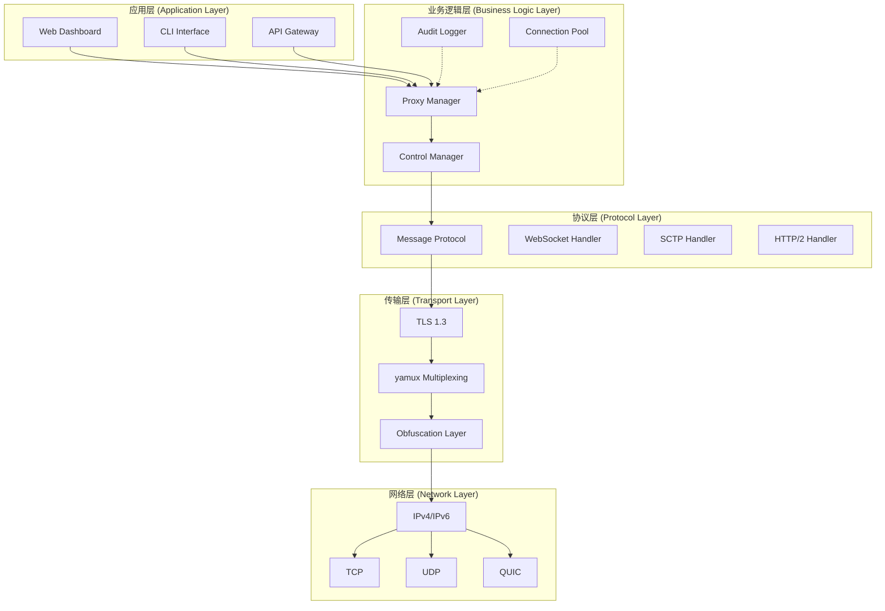
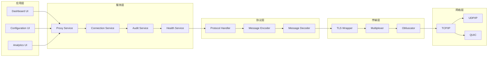
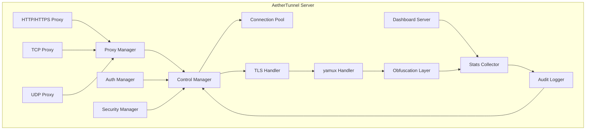
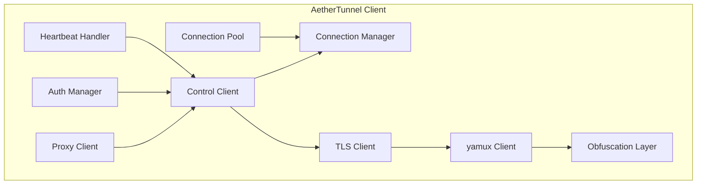
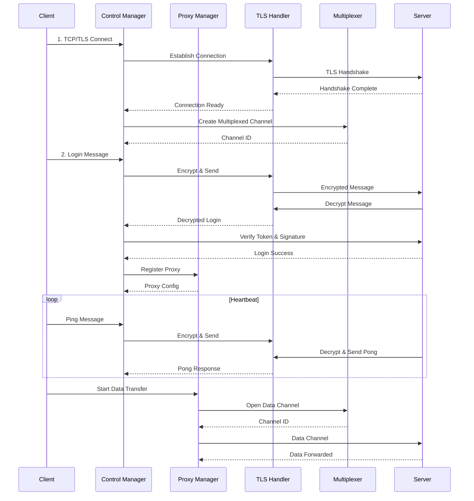
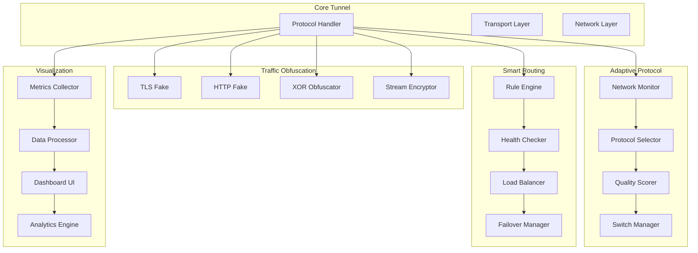
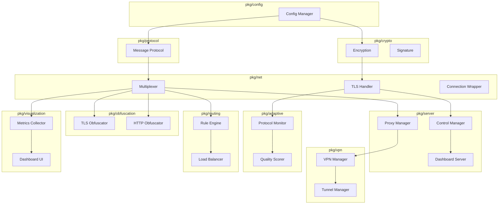
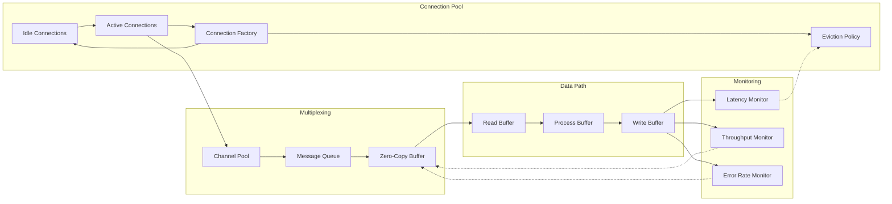
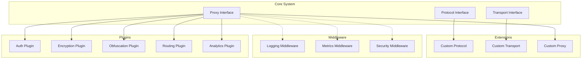

```mermaid
graph TB
    subgraph "Security Layers"
        SL1[Network Security]
        SL2[Transport Security]
        SL3[Application Security]
        SL4[Data Security]
    end

    subgraph "Network"
        NS1[Firewall]
        NS2[NAT Traversal]
        NS3[DDoS Protection]
    end

    subgraph "Transport"
        TS1[TLS 1.3]
        TS2[Perfect Forward Secrecy]
        TS3[Certificate Validation]
    end

    subgraph "Application"
        AS1[Token Authentication]
        AS2[Ed25519 Signature]
        AS3[IP Whitelist]
        AS4[Rate Limiting]
        AS5[IP Ban]
    end

    subgraph "Data"
        DS1[ChaCha20-Poly1305]
        DS2[Nonce Protection]
        DS3[Message Authentication]
        DS4[Encryption Key Rotation]
    end

    SL1 --> NS1
    SL1 --> NS2
    SL1 --> NS3

    SL2 --> TS1
    SL2 --> TS2
    SL2 --> TS3

    SL3 --> AS1
    SL3 --> AS2
    SL3 --> AS3
    SL3 --> AS4
    SL3 --> AS5

    SL4 --> DS1
    SL4 --> DS2
    SL4 --> DS3
    SL4 --> DS4
```

# AetherTunnel 系统架构图

## 📐 整体架构



## 🔧 分层架构



## 🏗️ 服务端架构



## 🌐 客户端架构



## 🔄 通信流程



## 📊 数据流架构

```mermaid
graph LR
    subgraph "External Traffic"
        E1[User Request]
        E2[Firewall]
        E3[NAT]
    end

    subgraph "Server"
        S1[HTTP Proxy]
        S2[TCP Proxy]
        S3[UDP Proxy]

        S4[Proxy Manager]
        S5[Connection Pool]

        S6[TLS Handler]
        S7[Multiplexer]
        S8[Obfuscation]
    end

    subgraph "Client"
        C1[Connection Manager]
        C2[Proxy Client]

        C3[TLS Client]
        C4[Multiplexer]
        C5[Obfuscation]
    end

    subgraph "Local Services"
        L1[Web Server]
        L2[SSH Server]
        L3[Database]
    end

    E1->>E2
    E2->>E3
    E3->>S1
    S1->>S4
    S4->>S5
    S5->>S6
    S6->>S7
    S7->>S8
    S8->>C3
    C3->>C4
    C4->>C5
    C5->>C2
    C2->>C1
    C1->>L1
    C1->>L2
    C1->>L3
```

## 🌟 创新功能架构



## 🗂️ 模块依赖关系



## 🚀 性能优化架构



## 🛡️ 安全架构



## 📈 扩展性架构



---

**架构图版本**: v1.0.2
**最后更新**: 2026-02-23
**维护者**: AetherTunnel Team
